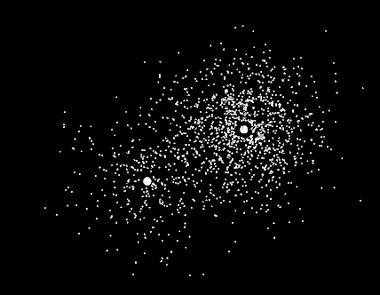
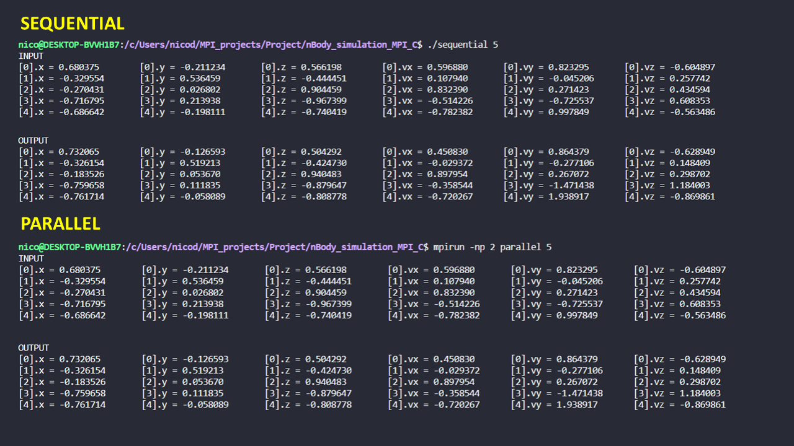
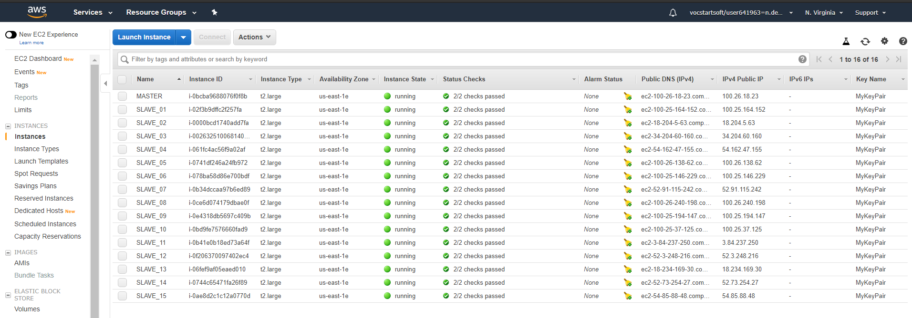
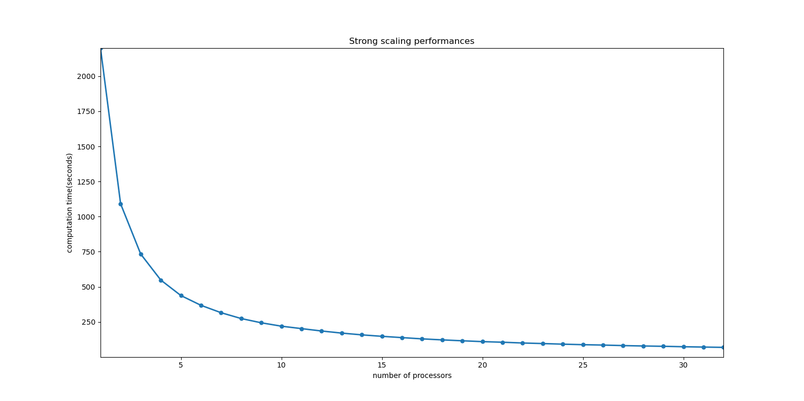
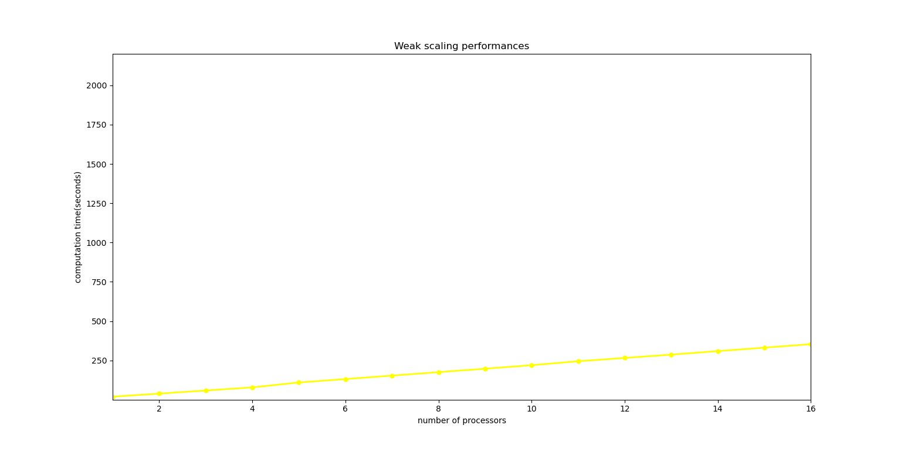
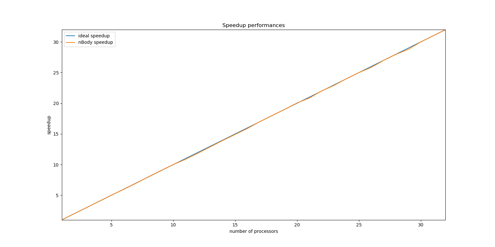
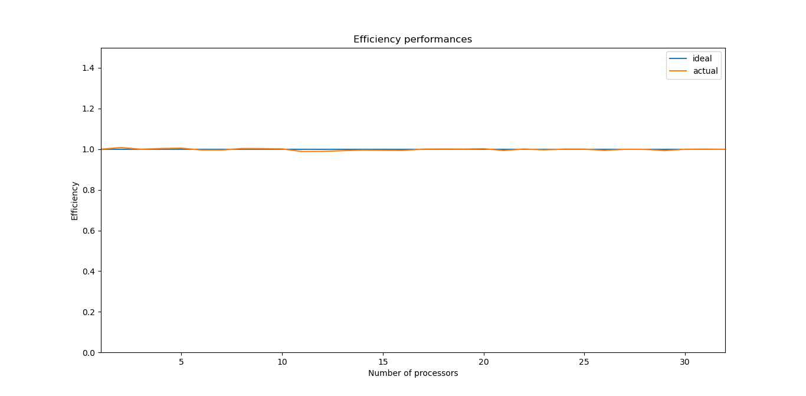

| N-Body Simulation | Nicola De Cristofaro | Data di consegna |
| --- | --- | --- |

# Descrizione del problema
In fisica, il problema n-body consiste nel predire i singoli movimenti di un gruppo di oggetti celesti che interagiscono tra loro in modo gravitazionale. La risoluzione di questo problema è stata motivata dal desiderio di comprendere i movimenti del Sole, della Luna, dei pianeti e delle stelle visibili.

<div style="text-align:center">
    
    
</div>

# Descrizione della soluzione
Per trovare la soluzione a questo problema è possibile simulare il comportamento delle particelle, ognuna avente una massa, una posizione e una velocità iniziale. La simulazione consentirà di calcolare la posizione e la velocità di ciascuna particella al termine di un intervallo di tempo determinato.

La soluzione proposta ha una complessità quadratica rispetto alla taglia dell'input (il numero di particelle). Esiste un tipo di simulazione, detta di Barnes – Hut che è più efficiente poichè tramite approssimazioni riesce ad eseguire con ordine O(n log n) ma è più complessa da implementare perciò si è preferito considerare la soluzione di complessità quadratica più semplice e concentrarsi sui concetti della programmazione parallela.

# Struttura della soluzione

## Inizializzazione
Per la fase di inizializzazione è stata adottata la tecnica di creare le particelle in un file e inizializzarle usando un algoritmo deterministico per randomizzare i valori delle particelle. In questo modo tutti i processori alla prima iterazione della computazione partono leggendo da questo file *(particles.txt)*.

Per la creazione e inizializzazione delle particelle eseguire i seguenti comandi:

1. ```bash
    gcc -o initialization particles_production.c
    ```
2. ```bash
    ./initialization [numero di particelle] (esempio -> ./initialization 1000)
    ```

## Inizializzazione di MPI, variabili e allocazione memoria
La prima parte del programma si occupa della definizione di variabili utili alla computazione, variabili per prendere i tempi di esecuzione e infine variabili per l'uso di MPI. Oltre alle operazioni sempre presenti come MPI_Init, MPI_Comm_size per conoscere il numero di processori che stanno eseguendo o MPI_Comm_rank per conoscere il rank del processore corrente, è stata fatta un'altra operazione per creare un tipo di dato derivato al fine di permettere la comunicazione tra i processori del tipo di dato Particle.

```c
    MPI_Type_contiguous(7, MPI_FLOAT, &particle_type);
    MPI_Type_commit(&particle_type);
```

dove la struttura Particle è la seguente:

```c
    typedef struct {
        float mass;
        float x, y, z;
        float vx, vy, vz;
    } Particle;
```

## Distribuziona equa del workload tra i processori
Viene quindi eseguita la funzione per distribuire equamente il lavoro tra i processori. Dopo l'esecuzione di questa funzione nell'array dim_portions ogni indice è associato al rank di un processore e il suo contenuto rappresenta la dimensione della porzione di array su cui quel processore dovrà computare. Inoltre viene impostato l'array dei displacements in cui ogni indice rappresenta lo start_offset di un processore.

```c
    void compute_equal_workload_for_each_task(int *dim_portions, int *displs, int arraysize, int numtasks){

        for(int i=0; i<numtasks;i++){
            dim_portions[i] = (arraysize / numtasks) +
                            ((i < (arraysize % numtasks)) ? 1 : 0);
        }

        int offset = 0;
        for(int i=0;i<numtasks;i++){
            displs[i] = offset;
            offset += dim_portions[i];
        }
    }
```

## Computazione e comunicazione tra i processori

- La simulazione avviene per un certo numero di iterazioni I impostato a 10. Inoltre consideriamo il processore con rank 0 il processore MASTER mentre gli altri vengono considerati SLAVES.

- Le operazioni effettuate in ogni iterazione sono le seguenti:

1. Solo nella prima iterazione tutti i processori leggono lo stato iniziale delle particelle dal file. Se invece non è la prima iterazione significa che il processore MASTER ha l'array di particelle aggiornato dopo la computazione dell'iterazione precedente quindi lo spedisce in broadcast a tutti gli altri processori per la nuova computazione.

```c
        if(iteration == 0){
            //E' la prima iterazione quindi tutti i processori possono leggere lo stato iniziale delle particelle da file
            FILE *fileRead = fopen("particles.txt", "r");
            if (fileRead == NULL){
                /* Impossibile aprire il file */
                printf("\nImpossibile aprire il file.\n");
                exit(EXIT_FAILURE);
            }

            /* Check errori sul numero di particelle lette */
            // ...

            fread(particles, sizeof(Particle) * num_particles, 1, fileRead);
            fclose(fileRead);
        }else{
            //il processore MASTER ha l'array di particelle output della computazine precedente quindi spedisce in broadcast
            MPI_Bcast(particles, num_particles, particle_type, MASTER, MPI_COMM_WORLD);
        }
```

2. Il processore MASTER spedisce inoltre a tutti i processorri la porzione di array la cui dimensione è stata calcolata in modo equo al passo precedente. **Da sottolineare che il processore MASTER non si occupa solo di gestire la comunicazione tra processori ma effettua anch'esso la computazione sulla sua porzione.**

```c
    MPI_Scatterv(particles, dim_portions, displ, particle_type,my_portion, dim_portions[myrank], particle_type,MASTER, MPI_COMM_WORLD);
```

3. Ogni processore effettua la computazione sulla sua porzione di array chiamando la funzione *bodyForce* che permette di calcolare i nuovi valori di posizione e velocità di ogni particella.

```c
    bodyForce(particles, my_portion, dt, dim_portions[myrank], num_particles );
```

4. Ogni processore spedisce al MASTER la propria porzione computata quindi dopo questa operazione di gathering il processore MASTER ha l'array di particelle completo e computato per una certa iterazione.

```c
    MPI_Gatherv(my_portion, dim_portions[myrank], particle_type, gathered_particles, dim_portions, displ, particle_type,MASTER, MPI_COMM_WORLD);
```

5. L'input della successiva iterazione dovrà essere l'array di particelle computato nell'iterazione corrente quindi viene effettuato uno swap.

```c
    if(myrank == MASTER) particles = gathered_particles;
```

6. Infine per ogni iterazione viene preso il tempo di esecuzione e il processore MASTER provvede a scrivere su stdout lo stato di avanzamento della computazione e il tempo impiegato per quella iterazione.

```c
    MPI_Barrier(MPI_COMM_WORLD);
    iterStart = MPI_Wtime();
    ...
    ...
    MPI_Barrier(MPI_COMM_WORLD);  
    iterEnd = MPI_Wtime();
    if(myrank == MASTER) printf("Iterazione %d di %d completata in %f seconds\n", iteration, I, (iterEnd-iterStart));
```

## Finalizzazione e deallocazione
In quest'ultima fase la computazione è conclusa per tutte le I iterazioni quindi viene deallocata tutta la memoria precedentemente allocata, viene finalizzato MPI con MPI_Finalize() e il processore MASTER provvede a scrivere su stdout il tempo medio di esecuzione di un'iterazione e il tempo totale di esecuzione, scrivendo inoltre lo stato finale delle particelle su un file per un eventuale test di correttezza fatto in seguito.

## Compilazione ed esecuzione

#### Compilazione 
```bash
    mpicc -o parallel parallel_nBody.c -lm
```

#### Esecuzione 
```bash
    mpirun -np [numero di processori] parallel [numero di particelle]
    esempio -> mpirun -np 4 parallel 1000
```

# Correttezza

- Per la correttezza di un programma in parallelo è necessario che l'esecuzione con P processori o con un solo processore, con lo stesso input produca lo stesso output. Per verificare questa condizione è stato fatto in modo che l'output dell'esecuzione parallela con più processori sia stato scritto su file *(parallel_output.txt)*.

- Eseguiamo ora la versione sequenziale del programma che può essere eseguita sia utilizzando la versione parallela su 1 processore, sia utilizzando la versione sequenziale che evita anche l'inizializzazione e finalizzazione di MPI.

1. ```bash
    gcc -o sequential sequential_nBody.c -lm
    ```

2. ```bash
    ./sequential [numero di particelle] 
    esempio -> ./sequential 1000
    ```
    **OPPURE**

 1. ```bash
    mpicc -o parallel parallel_nBody.c -lm
    ```

2. ```bash
    mpirun -np 1 parallel [numero di particelle]
    esempio -> mpirun -np 1 parallel 1000
    ```

- L'output della versione sequenziale verrà scritto sul file *(sequential_output.txt)*. E' stato poi realizzato un programma *(output_correctness.c)* che mette a confronto il contenuto del file con l'output sequenziale e del file con l'output parallelo per verificarne la correttezza.

- Dopo aver eseguito il programma sia nella versione parallela che quella sequenziale come indicato precedentemente è possibile eseguire il test di correttezza nel seguente modo:

1. ```bash
    gcc -o correctness output_correctness.c
    ```

2. ```bash
    ./correctness [numero di particelle] (esempio -> ./correctness 1000)
    ```

- Da sottolineare che per quanto riguarda i confronti tra gli attributi delle particelle per stabilirne la correttezza è stata utilizzata una funzione per confrontare i valori float. Questo perchè la matematica in virgola mobile non è esatta. Valori semplici come 0,2 non possono essere rappresentati con precisione usando numeri binari in virgola mobile e questa precisione limitata dei numeri in virgola mobile significa che lievi variazioni nell'ordine delle operazioni possono cambiare il risultato. Quindi, dato che questi valori vengono memorizzati con precisioni diverse, i risultati possono differire. Di conseguenza se si eseguono vari calcoli e quindi si confrontano i risultati con un valore atteso, è altamente improbabile che si ottenga esattamente il risultato desiderato. Per questo motivo con la funzione realizzata possiamo esprimere il concetto che due valori abbastanza vicini tra loro possono essere considerati uguali.

- In pratica, due valori di tipo float sono considerati uguali se la loro differenza rientra in un certo limite o valore epsilon.

```c
//confronta due float e ritorna 1 se sono uguali 0 altrimenti
int compare_float(float f1, float f2){

    float precision = 0.01f;
    if (((f1 - precision) < f2) &&
        ((f1 + precision) > f2))
        return 1;
    else
        return 0;
}
```

- **Visualizzazione grafica della correttezza della soluzione parallela su input piccolo (5)**



# Problem evaluation and Benchmarks

Per la valutazione delle prestazioni della soluzione proposta sono state create delle versioni dei programmi **(sequenziale: sequential_nBody_benchmarking.c - parallela: parallel_nBody_benchmarking.c)** leggermente revisionate poichè per effettuare un migliore benchmarking è stata eliminata la scrittura dell'output finale su file per focalizzarci sul tempo computazione.

Possiamo ora procedere con la descrizione dei risultati dati dalla misurazione della scalabilità dell'applicazione. Ci sono due modi di base per misurare la performance parallela di un'applicazione: **strong e weak scaling**.

## Strong Scaling

In questo tipo di misurazione la taglia del problema (il numero di particelle) resta fissata ma il numero di processori aumenta. 



**Per il testi di strong scaling il range di aumento del numero dei processori è stato fissato da 1 a 32 poichè 32 è il massimo numero di core che è possibile usare con un account AWS Educate**


|   P	|   N	|   Avg Iteration Time (seconds)	|   Total Computation Time (seconds)	|   Strong Scaling Efficiency (%)  |
|:-:	|:-:	|:-:	|:-:	|:-:	|
|   1	|  100 000	|   220.005443	|   2200.054430 ≅ 37 min	| 100   |
|   2	|  100 000 	|   109.134224 	|   1091.342241 	|   100 |
|   3	|  100 000	|   73.359361	|   733.593608 	|   99  |
|   4	|  100 000 	|   54.819589	|   548.195891  |   100 |
|   5	|  100 000 	|   43.785572	|   437.855721	|   100 |
|   6	|  100 000 	|   36.821113	|   368.211132 	|   99  |
|   7	|  100 000 	|   31.567646	|   315.676457 	|   99  |
|   8	|  100 000 	|   27.412049	|   274.120492  |   100 |
|   9	|  100 000 	|   24.375618	|   243.756177 	|   100 |
|   10	|  100 000 	|   21.972933	|   219.729333 	|   100 |
|   11	|  100 000 	|   20.238017	|   202.380169 	|   98  |
|   12	|  100 000 	|   18.540094	|   185.400640 	|   98  |
|   13	|  100 000 	|   17.049654	|   170.496536 	|   99  |
|   14	|  100 000 	|   15.787466	|   157.874664 	|   99  |
|   15	|  100 000 	|   14.750758	|   147.507577 	|   99  |
|   16	|  100 000 	|   13.837183	|   138.371826 	|   99  |
|   17	|  100 000 	|   12.937212	|   129.372124	|   100 |
|   18	|  100 000 	|   12.210964	|   122.109644 	|   100 |
|   19	|  100 000 	|   11.575181	|   115.751814  |   100 |
|   20	|  100 000 	|   10.975263	|   109.752627 	|   100 |
|   21	|  100 000 	|   10.547308	|   105.473079  |   99  |
|   22	|  100 000 	|   9.991014	|   99.910142   |   100 |
|   23	|  100 000 	|   9.599492	|   95.994917   |   99  |
|   24	|  100 000 	|   9.162451	|   91.624507   |   100 |
|   25	|  100 000 	|   8.797949	|   87.979485   |   100 |
|   26	|  100 000 	|   8.514978	|   85.149779   |   99  |
|   27	|  100 000 	|   8.152149	|   81.521492   |   99  |
|   28	|  100 000 	|   7.863964	|   78.639643   |   99  |
|   29	|  100 000 	|   7.639826	|   76.398257   |   99  |
|   30	|  100 000 	|   7.336128	|   73.361283   |   99  |
|   31	|  100 000 	|   7.095153	|   70.951534   |   100 |
|   32	|  100 000 	|   6.880448	|   68.804478   |   99  |



Dalle misurazioni effettuate per verificare la **strong scalability** abbiamo notato come su una stessa taglia di input, l'aggiunta di processori ha migliorato il tempo di esecuzione, ma ovviamente per ogni processore aggiunto il miglioramento non è stato costante poichè più processori partecipavano alla computazione, maggiore era l'overhead prodotto dalla comunicazione di questi. Nel nostro test fino a 32 processori il tempo di esecuzione è sempre diminuito ma più il numero di processori aumentava più il miglioramento delle prestazioni diminuiva. Se fossimo andati avanti, aggiungendo altri processori saremmo arrivati ad un punto in cui il tempo di esecuzione non diminuiva più, ma cominciava ad aumentare poichè l'overhead prodotto era maggiore del miglioramento di prestazioni.

## Weak Scaling

In questo caso la taglia del problema aumenta con l'aumentare del numero di processori, facendo in modo che il workload sia sempre equamente distribuito tra i processori.

|   P	|   N	|   Avg Iteration Time (seconds)	|   Total Computation Time (seconds)	|   Weak Scaling Efficiency (%)  |
|:-:	|:-:	|:-:	|:-:	|:-:	|
|   1	|  10 000	|   1.961227	|   19.612270	|   100 |
|   2	|  20 000 	|   3.921892	|   39.218918	|   50  |
|   3	|  30 000	|   5.893506	|   58.935057	|   33  |
|   4	|  40 000 	|   7.872926	|   78.729259	|   24  |
|   5	|  50 000 	|   10.999243	|   109.992425	|   17  |
|   6	|  60 000 	|   13.164654	|   131.645642	|   14  |
|   7	|  70 000 	|   15.374346	|   153.743464	|   12  |
|   8	|  80 000 	|   17.566746	|   175.667462	|   11  |
|   9	|  90 000 	|   19.766140	|   197.661402	|   9   |
|   10	|  100 000 	|   21.990926	|   219.909259	|   8   |
|   11	|  110 000 	|   24.507350	|   245.073497	|   8   |
|   12	|  120 000 	|   26.600296	|   266.022962	|   7   |
|   13	|  130 000 	|   28.731199	|   287.311988	|   6   |
|   14	|  140 000 	|   30.937833	|   309.378334	|   6   |
|   15	|  150 000 	|   33.151154	|   331.511537	|   5   |
|   16	|  160 000 	|   35.357112	|   353.571116	|   5   |



Il grafico ideale della performance di **weak scalability** sarebbe una linea retta poichè l'aumento della taglia dell'input è collegato all'aumento del numero di processori, quindi se il workload è sempre equamente distrubuito il tempo di computazione dovrebbe essere sempre lo stesso. Purtroppo questo non accade poichè, come abbiamo già detto, per ogni processore aggiunto viene prodotta una quantità maggiore di overhead, dovuto principalmente alla comunicazione tra i processori. Dal nostro esperimento abbiamo avuto comunque buoni risultati poichè con l'aumentare dei processori e della taglia dell'input il tempo di esecuzione è aumentato minimamente ad ogni step, rimanendo relativamente vicino all'ideale.

## Speedup ed efficienza
Lo speedup è un'altra metrica di misurazione delle performance che rappresenta il miglioramento delle prestazioni di un programma dovuto a un'esecuzione parallela rispetto a una sequenziale.

Di solito il meglio in cui possiamo sperare è di dividere il lavoro tra i processori senza aggiungere ulteriore tempo di lavoro extra. In una situazione del genere se lanciamo il nostro programma con P processori allora il programma eseguirà P volte più velocemente del programma sequenziale. Se questo accade diciamo che il programma parallelo ha **speedup lineare**.

In pratica, difficilmente riusciamo ad ottenere questo tipo di speedup poichè l'uso di più processori introduce nella maggior parte dei casi un tempo di "overhead" ovvero un tempo extra impiegato principalmente per operazioni di comunicazione tra i processori.

L'efficienza invece è definita come il rapporto tra speedup e numero di processori e misura la frazione di tempo durante il quale un processore viene utilmente utilizzato.

Di seguito i valori relativi allo speedup e all'efficienza calcolati nel seguente modo:

**Speedup**
$$ S(P,N) = \frac{T(1,N)}{T(P,N)} $$

**Efficiency**
$$ E = \frac{S}{P} = \frac{\frac{T(1,N)}{T(P,N)}}{P} = \frac{T(1,N)}{p * T(P,N)}$$

dove :
+ **P = numero di processori usati**
+ **N = taglia dell'input**


|   P	|   N	|   Speedup	| Efficiency |
|:-:	|:-:	|:-:	|:-:	|
|   1	|  100 000	|  1.0 | 1.00 |
|   2	|  100 000 	|  2.0 | 1.00 |
|   3	|  100 000	|  3.0 | 1.00 |
|   4	|  100 000 	|  4.0 | 1.00 |
|   5	|  100 000 	|  5.0 | 1.00 |
|   6	|  100 000 	|  5.9 | 1.00 |
|   7	|  100 000 	|  6.9 | 1.00 |
|   8	|  100 000 	|  8.0 | 1.00 |
|   9	|  100 000 	|  9.0 | 1.00 |
|   10	|  100 000 	|  10.0 | 1.00|
|   11	|  100 000 	|  10.9 | 0.99|
|   12	|  100 000 	|  11.9 | 0.99|
|   13	|  100 000 	|  12.9 | 0.99|
|   14	|  100 000 	|  13.9 | 0.99|
|   15	|  100 000 	|  14.9 | 1.00|
|   16	|  100 000 	|  15.9 | 0.99|
|   17	|  100 000 	|  17.0 | 0.99|
|   18	|  100 000 	|  18.0 | 1.00|
|   19	|  100 000 	|  19.0 | 1.00|
|   20	|  100 000 	|  20.0 | 1.00|
|   21	|  100 000 	|  20.9 | 1.00|
|   22	|  100 000 	|  22.0 | 0.99|
|   23	|  100 000 	|  22.9 | 1.00|
|   24	|  100 000 	|  24.0 | 1.00|
|   25	|  100 000 	|  25.0 | 1.00|
|   26	|  100 000 	|  25.8 | 0.99|
|   27	|  100 000 	|  27.0 | 1.00|
|   28	|  100 000 	|  28.0 | 1.00|
|   29	|  100 000 	|  28.8 | 0.9|
|   30	|  100 000 	|  30.0 | 1.00|
|   31	|  100 000 	|  31.0 | 1.00|
|   32	|  100 000 	|  32.0 | 1.00|





Abbiamo notato come, sorprendentemente, sia lo **speedup** che l'**efficienza** sono sempre stati molto vicini all'ideale, questo perchè sono calcolati in funzione di quante operazioni riusciamo ad eseguire in parallelo e nel nostro caso abbiamo avuto ottimi risultati poichè, tranne per alcune istruzioni in più eseguite dal processore MASTER, tutte le istruzione del programma sono state eseguite in parallelo.

Inoltre la comunicazione tra i processori è effettuata interamente utilizzando funzioni di comunicazione collettiva della libreria MPI e questo è un altro fattore che migliora le prestazioni poichè fa in modo che qualsiasi nodo con le informazioni ricevute partecipi all'invio delle informazioni ad altri nodi.


# Conclusioni

Dalle considerazione effettuate sulla strong scalability, weak scalability e sullo speedup ed efficienza possiamo concludere che abbiamo raggiunto buoni risultati e notato evidenti miglioramenti con l'aggiunta di altri processori. Infatti essendo un problema di complessità quadratica il tempo di esecuzione sequenziale era davvero elevato (su taglia di input 100 000 il tempo totale di esecuzione era circa 37 minuti). Impiegando 32 processori in parallelo il tempo totale di computazione è diminuito fino a circa 1 minuto, notando così la potenza di una computazione parallela.


